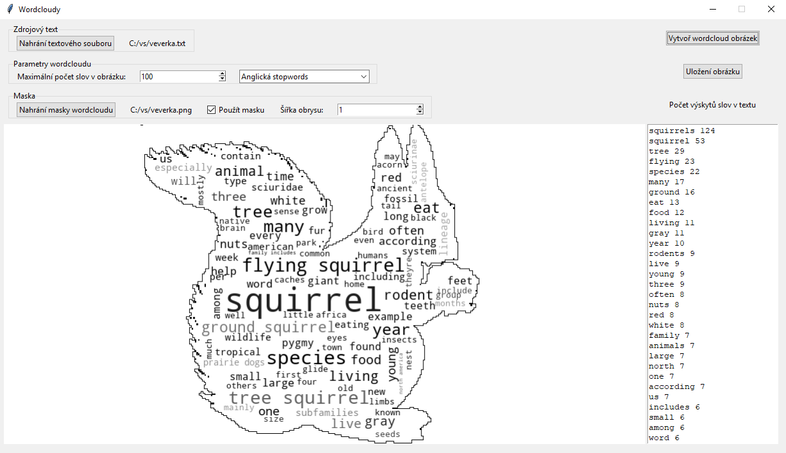

# O programu

Program vytváří wordcloudy (obrázky tvořené na základě určitého textu, přičemž častěji se vyskytující slova jsou v obrázku větší), které mohou nabývat kromě obdelníkového tvaru i obrysů masky - dalšího (normálního) obrázku. Pro samotné vytváření wordcloudů se používá balíček wordcloud (https://github.com/amueller/word_cloud). Smyslem zde předkládaného programu je obalení funkcionalit zmíněného balíčku windosowským rozhraním, aby se uživatel nemusel zatěžovat prací s konzolí nebo s pythonovským programováním.

# Historie
21. 7. 2018 První verze
4. 8. 2019  Začištění kódu, přidání testů, ošetření problému s kódováním textových souborů, wordcloudy s maskou mohou mít nyní obrysy
